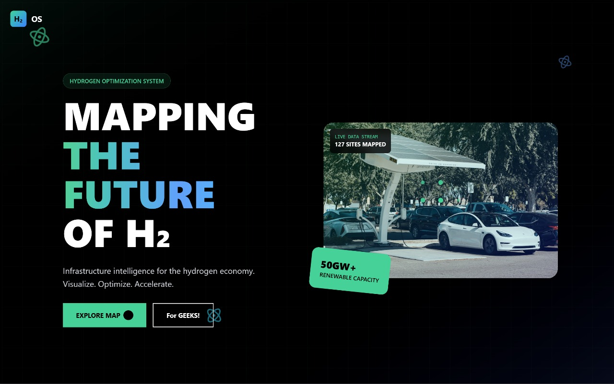
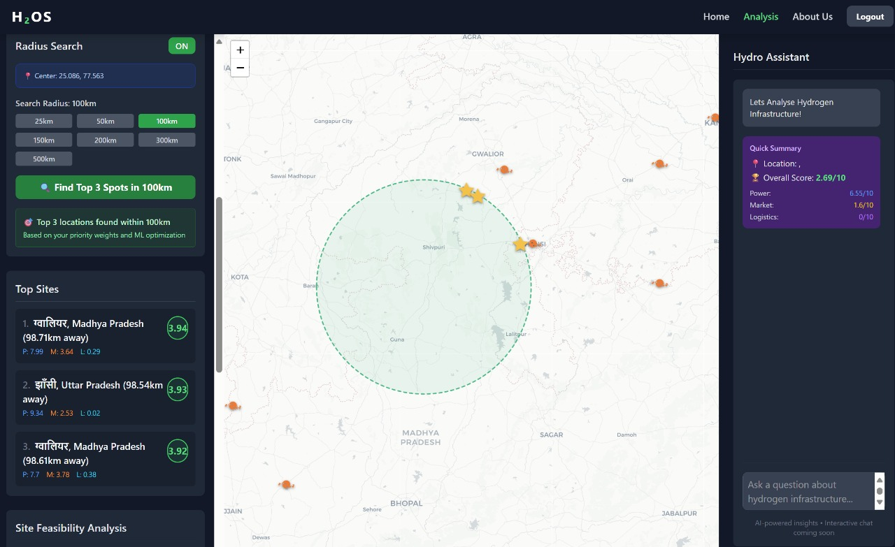

# Green Hydrogen Project Feasibility Analyzer 🌱⚡

## 📸 Project Screenshots

### Landing Page


### Interactive Dashboard


---

## Hey there! Let's Talk About This Project 👋

Alright, so picture this: India is going big on green hydrogen, and everyone's asking the million-dollar question - **"Where do we even build these plants?"** That's where we come in.

We built a full-stack web application that's basically a smart assistant for making data-driven decisions about green hydrogen infrastructure. Think of it as Google Maps meets AI-powered feasibility analysis, specifically designed for India's renewable energy sector.

### What Problem Are We Solving?

Setting up a green hydrogen facility isn't like opening a coffee shop. You need:
- **Renewable energy sources** nearby (solar/wind plants to power electrolysis)
- **Market access** (industries and demand centers that'll actually buy the hydrogen)
- **Logistics infrastructure** (ports and transport hubs to ship your product)
- **Economic zones** (SEZs with incentives and support)

Traditionally, analyzing all this would take weeks of manual research, spreadsheets, and guesswork. We condensed it into an interactive web app that does it in real-time.

---

## The Tech Stack - A Complete Breakdown 🛠️

Let me walk you through what we used and *why* we chose each piece. This is where the technical journey gets interesting!

### Frontend: The Face of Our App 🎨

**Core Framework: React 19 + TypeScript + Vite**

Why React? Simple - component reusability. When you're building multiple data panels, map layers, and interactive widgets, React's component model is a lifesaver. We went with React 19 (the latest at the time) because why not get those sweet performance improvements?

TypeScript adds type safety - crucial when you're passing around complex data structures like GeoJSON features, optimization results, and API responses. Trust me, you don't want to debug `undefined is not a function` at 3 AM during a hackathon.

Vite is our build tool. It's insanely fast. Hot Module Replacement (HMR) during development feels instant compared to older tools like Create React App.

**Mapping: Leaflet.js**

For rendering the interactive map, we use **Leaflet.js** - an open-source JavaScript library for mobile-friendly interactive maps. Why Leaflet over Google Maps API?
- It's free (no API key headaches)
- Works seamlessly with OpenStreetMap tiles
- Lightweight and highly customizable
- Perfect for plotting thousands of markers (solar plants, wind farms, demand centers)

**UI Components & Styling**

- **Lucide React**: Modern, clean icons. Way better looking than FontAwesome for our use case.
- **Framer Motion**: Smooth animations for panel transitions, hover effects, and page transitions. Makes the UX feel polished.
- **CSS/Inline Styling**: We kept it simple - no heavy component libraries like MUI or Ant Design. Direct styling gave us full control over the look and feel.

**Routing: React Router DOM v7**

Multi-page navigation between:
- Landing page (marketing/info)
- Dashboard (the actual analysis tool)
- About Us section

**State Management: React Hooks**

No Redux, no Zustand - just good old `useState`, `useEffect`, and `useMemo`. For a project of this scope, React's built-in state management was sufficient. We use:
- `useState` for layer toggles, slider values, selected coordinates
- `useEffect` for API calls when weights change
- `useMemo` to avoid re-computing expensive GeoJSON transformations

---

### Backend: The Brain of the Operation 🧠

**Web Framework: Flask (Python)**

Flask is our API server. Why Flask and not Django or FastAPI?
- **Lightweight**: We don't need Django's entire ORM and admin panel
- **Flexible**: Perfect for building a REST API quickly
- **Python ecosystem**: Direct access to NumPy, Pandas, SciPy - our data processing workhorses

**Flask-CORS**: Handles Cross-Origin Resource Sharing so our frontend (running on Vite's dev server) can talk to our backend (running on port 5000) without browser security issues.

**Data Processing Stack**

This is where the magic happens:

1. **Pandas**: Think of it as Excel on steroids. We load CSV files (solar plants, wind farms, demand centers, ports, SEZ data) and manipulate them as DataFrames. Filtering, aggregating, merging - Pandas handles it all.

2. **NumPy**: Under the hood for numerical operations. Array computations are blazing fast compared to Python lists.

3. **Scikit-learn**: Primarily used for the **Haversine formula** - calculating great-circle distances between two points on Earth. When you ask "how far is this location from the nearest solar plant?", Haversine gives you the answer in kilometers, accounting for Earth's curvature.

**Optimization Engine: SciPy**

Here's where it gets interesting. We use **SciPy's optimization algorithms** for:
- **Grid-based search**: Divide India into a grid, evaluate each cell
- **Linear programming**: Optimize supply routes between production and demand centers
- **Scoring functions**: Weighted multi-criteria decision-making (more on this below)

**AI-Powered Reasoning: CrewAI + Google Gemini**

This is the coolest part. We integrate **Google's Gemini AI model** through the **CrewAI framework**:

- **CrewAI**: A multi-agent AI framework. Think of it as a team of AI agents working together. Each agent has a role (e.g., "Data Analyst", "Feasibility Advisor").
- **Google Gemini**: Our LLM of choice. When you get a feasibility score (e.g., 78/100), Gemini explains *why* in natural language:
  - "This location scores 78/100 because it's 15km from a major solar park, but demand centers are 120km away..."

The AI doesn't just spit out numbers - it provides actionable insights investors can actually use.

---

### Data Pipeline: From Raw CSVs to Actionable Insights 📊

**Data Sources (All India-Specific)**

We scraped and compiled data from:
- **Renewable energy databases**: Solar and wind plant locations, capacities, operational status
- **Industrial zones**: SEZ data, manufacturing hubs, potential hydrogen demand centers
- **Logistics**: Major ports, rail terminals, highways
- **Government reports**: Parliamentary session data on renewable energy projects

**Preprocessing Pipeline**

Before feeding data to our algorithms, we clean it:

1. **Data Cleaning** (`preprocess_data.py`):
   - Remove rows with missing latitude/longitude
   - Standardize capacity units (some datasets mix MW and kW)
   - Remove duplicates

2. **Geocoding**: Convert addresses to coordinates where needed

3. **Quality Checks**: Flag outliers (e.g., coordinates in the ocean)

**Cleaned Outputs**:
- `cleaned_solar_plants.csv`
- `cleaned_wind_plants.csv`
- `cleaned_demand_centers.csv`
- `ports.csv`

These preprocessed files live in `/backend/app/data/app/data/` and are loaded into memory when the Flask app starts.

---

### The Optimization Algorithm: How We Score Locations 🎯

This is the core logic. Here's how it works:

**Multi-Criteria Scoring Model**

Every location gets a score (0-100) based on four factors:

1. **Power Proximity (Default weight: 25%)**
   - Distance to nearest solar plant
   - Distance to nearest wind farm
   - Combined renewable capacity within 50km radius
   - *Why it matters*: Green hydrogen needs renewable electricity. Closer = lower transmission costs.

2. **Market Access (Default weight: 25%)**
   - Distance to demand centers (refineries, steel plants, fertilizer factories)
   - Projected hydrogen demand in the region
   - *Why it matters*: No point making hydrogen if no one's buying.

3. **Logistics Infrastructure (Default weight: 25%)**
   - Distance to nearest port
   - Proximity to national highways
   - Rail connectivity
   - *Why it matters*: Hydrogen needs to be transported (pipelines, trucks, ships).

4. **Opportunity Score (Default weight: 25%)**
   - Presence of SEZs (tax benefits)
   - Government incentive zones
   - Land availability
   - *Why it matters*: Economics. SEZs offer subsidies and faster clearances.

**The Scoring Function**

```
Final Score = (PowerScore × w1) + (MarketScore × w2) + (LogisticsScore × w3) + (OpportunityScore × w4)
```

Users can adjust weights via sliders in the UI. If you care more about market access, bump that weight to 40% and reduce others.

**Haversine Distance Calculation**

For every location, we compute distances to all nearby assets using the Haversine formula:

```
d = 2r × arcsin(√[sin²((lat2-lat1)/2) + cos(lat1)cos(lat2)sin²((lon2-lon1)/2)])
```

Where `r` = Earth's radius (6371 km). This accounts for the Earth's spherical shape.

**Grid-Based Optimization**

The `/api/optimize-grid` endpoint:
1. Creates a grid over India (e.g., 0.1° × 0.1° cells)
2. Scores each cell using the multi-criteria model
3. Returns the top N locations

This is computationally expensive (thousands of cells × thousands of distance calculations), so we use NumPy's vectorized operations for speed.

---

## Features and Functionality 🚀

### Core Optimization Engine

- **Grid-based Analysis**: Evaluates locations across India using a comprehensive grid system
- **Multi-criteria Decision Making**: Considers power proximity, market access, and logistics infrastructure
- **Weighted Scoring System**: Users can customize importance weights for different factors (via sliders)
- **Real-time Feasibility Assessment**: Provides immediate scoring for any geographic coordinate you click

### AI-Powered Insights (CrewAI + Gemini)

- **Intelligent Reasoning**: AI agent explains feasibility scores in natural language
- **Data-driven Recommendations**: Actionable insights like "Consider moving 20km north for better port access"
- **Customizable Analysis**: Adapts explanations based on user priorities and weights
- **2-3 Sentence Summaries**: Concise, jargon-free explanations

### Interactive API (RESTful Backend)

- **RESTful Endpoints**: Clean API design for frontend-backend communication
- **GeoJSON Support**: Returns map data in standardized GeoJSON format (compatible with Leaflet)
- **Error Handling**: Robust validation (e.g., rejects invalid coordinates, missing weights)

---

## Project Architecture 🏗️

### Directory Structure Explained

```
Placement-Ke-Pyaase-Hackout25/
├── backend/                          # Flask API Server
│   ├── config.py                     # App config (API keys, DB settings)
│   ├── requirements.txt              # Python dependencies (pip install -r requirements.txt)
│   ├── run.py                        # Entry point - starts the Flask server
│   ├── supply_chain_optimizer.py    # Core optimization algorithms
│   ├── test_script.py                # Unit tests for optimization logic
│   │
│   └── app/                          # Main application package
│       ├── __init__.py               # Flask app factory (creates the Flask instance)
│       │
│       ├── api/                      # REST API layer
│       │   ├── __init__.py           # Registers API blueprints
│       │   └── routes.py             # All endpoint definitions (GET/POST handlers)
│       │
│       ├── data/                     # Raw and processed datasets
│       │   ├── *.csv                 # Raw CSV files (solar plants, demand centers, etc.)
│       │   └── app/data/             # Cleaned/preprocessed CSVs
│       │       ├── cleaned_demand_centers.csv
│       │       ├── cleaned_solar_plants.csv
│       │       ├── cleaned_wind_plants.csv
│       │       └── ports.csv
│       │
│       ├── services/                 # Business logic layer
│       │   ├── optimization_service.py   # Scoring and grid optimization
│       │   ├── reasoning_agent.py        # AI reasoning with CrewAI + Gemini
│       │   └── api_test.py               # API integration tests
│       │
│       └── utils/                    # Helper functions
│           └── data_loader.py        # Loads CSVs into Pandas DataFrames
│
├── frontend/                         # React + TypeScript + Vite
│   ├── package.json                  # Node.js dependencies
│   ├── vite.config.ts                # Vite bundler config
│   ├── tsconfig.json                 # TypeScript compiler config
│   ├── index.html                    # Root HTML file
│   ├── index.tsx                     # React app entry point
│   ├── App.tsx                       # Main app component (routing setup)
│   ├── types.ts                      # TypeScript type definitions
│   │
│   ├── components/                   # React components
│   │   ├── Dashboard.tsx             # Main analysis dashboard
│   │   ├── Map.tsx                   # Leaflet map component
│   │   ├── Navbar.tsx                # Top navigation bar
│   │   ├── DataLayersPanel.tsx       # Left sidebar - layer toggles
│   │   ├── ResultsPanel.tsx          # Displays top-scoring sites
│   │   ├── SlidersPanel.tsx          # Weight adjustment sliders
│   │   ├── AnalysisSidebar.tsx       # Right sidebar - analysis controls
│   │   ├── FeasibilityPanel.tsx      # Shows feasibility scores
│   │   ├── PowerSupplyPanel.tsx      # Power infrastructure details
│   │   ├── RadiusPanel.tsx           # Radius-based filtering
│   │   ├── VisualAnalytics.tsx       # Charts and graphs
│   │   └── landing/                  # Landing page components
│   │       ├── Home.tsx
│   │       ├── Hero.tsx
│   │       ├── HydroAI.tsx           # AI assistant section
│   │       ├── Problem.tsx
│   │       ├── Solution.tsx
│   │       └── ...
│   │
│   ├── data/                         # Frontend data files
│   │   ├── indiaData.ts              # India map GeoJSON boundaries
│   │   └── mockData.ts               # Sample data for development
│   │
│   └── src/
│       └── services/
│           └── api.js                # API client (fetch calls to Flask backend)
│
└── README.md                         # You're reading it! 📖
```

**Key Architectural Decisions:**

1. **Separation of Concerns**: Backend handles heavy computation, frontend handles presentation. Clean API boundary.

2. **Service Layer Pattern**: `services/` contains business logic, separated from route handlers in `api/routes.py`. Makes testing easier.

3. **Data Preprocessing**: We preprocess CSVs once and store cleaned versions. The app loads these at startup instead of raw files.

4. **Component-Based UI**: Each dashboard panel is a separate React component. Reusable and maintainable.

---

## API Endpoints Deep Dive 🌐

### 1. `POST /api/optimize`
**Purpose**: Calculate opportunity scores across India with custom weights

**Request Body:**
```json
{
  "powerWeight": 0.3,      // 30% weight on renewable proximity
  "marketWeight": 0.4,     // 40% weight on market access
  "opportunityWeight": 0.15, // 15% weight on SEZ/incentives
  "logisticsWeight": 0.15   // 15% weight on ports/roads
}
```

**Response**: GeoJSON FeatureCollection with scored locations

**What Happens Internally:**
1. Load all cleaned datasets
2. For each grid cell:
   - Calculate distance to nearest solar/wind plants
   - Calculate distance to demand centers
   - Calculate distance to ports
   - Compute weighted score
3. Return top 100 results as GeoJSON

---

### 2. `GET /api/initial-map-data`
**Purpose**: Get all data points for initial map rendering

**Response**: GeoJSON with features for:
- Solar plants (green markers)
- Wind farms (blue markers)
- Demand centers (red markers)
- Ports (orange markers)

**Frontend Usage**: Called once on page load to populate the map.

---

### 3. `POST /api/optimize-grid`
**Purpose**: Grid-based optimization returning top N locations

**Request Body:**
```json
{
  "powerWeight": 0.25,
  "marketWeight": 0.25,
  "opportunityWeight": 0.25,
  "logisticsWeight": 0.25,
  "topN": 10  // Return top 10 locations
}
```

**Response**: Sorted list of locations with scores

**Use Case**: When user adjusts sliders, frontend calls this to refresh results.

---

### 4. `POST /api/optimize-point`
**Purpose**: Get feasibility score for a single coordinate (e.g., user clicks on map)

**Request Body:**
```json
{
  "latitude": 23.0225,
  "longitude": 72.5714,  // Ahmedabad, Gujarat
  "powerWeight": 0.25,
  "marketWeight": 0.25,
  "opportunityWeight": 0.25,
  "logisticsWeight": 0.25
}
```

**Response:**
```json
{
  "score": 82,
  "breakdown": {
    "power": 90,
    "market": 75,
    "logistics": 80,
    "opportunity": 85
  }
}
```

**Frontend Integration**: When you click on the map, this endpoint calculates the score for that exact spot.

---

### 5. `POST /api/analyze-reasoning`
**Purpose**: Get AI-generated explanation for a feasibility score

**Request Body:**
```json
{
  "score": 82,
  "breakdown": {
    "power": 90,
    "market": 75,
    "logistics": 80,
    "opportunity": 85
  },
  "weights": {
    "powerWeight": 0.25,
    "marketWeight": 0.25,
    "opportunityWeight": 0.25,
    "logisticsWeight": 0.25
  }
}
```

**Response:**
```json
{
  "reasoning": "This location scores 82/100, making it highly suitable. Power availability is excellent (90) with nearby renewable sources. Market access is good (75), though demand centers are moderately distant. Logistics infrastructure is strong (80) with port proximity. Consider this a strong candidate for investment."
}
```

**How It Works:**
1. Flask calls CrewAI's reasoning agent
2. Agent formats data into a prompt for Gemini
3. Gemini generates natural language explanation
4. Response sent back to frontend

**Why This Is Awesome**: Non-technical investors can understand *why* a location is good/bad without reading raw numbers.

---

## Setup and Running Instructions 🚀

### Prerequisites

- **Python 3.8+** (tested on 3.9, 3.10)
- **Node.js 16+** (for frontend)
- **pip** (Python package manager)
- **Google Gemini API key** (get it from [Google AI Studio](https://ai.google.dev/))

---

### Backend Setup

1. **Clone the repository**
   ```bash
   git clone <your-repo-url>
   cd Placement-Ke-Pyaase-Hackout25
   ```

2. **Navigate to backend**
   ```bash
   cd backend
   ```

3. **Install dependencies**
   ```bash
   pip install -r requirements.txt
   ```

   This installs:
   - Flask (web framework)
   - Flask-CORS (cross-origin support)
   - Pandas (data manipulation)
   - NumPy (numerical computing)
   - SciPy (optimization)
   - Scikit-learn (Haversine distance)
   - CrewAI (AI agent framework)
   - Google Generative AI SDK (Gemini integration)

4. **Set up environment variables**

   **On Linux/Mac:**
   ```bash
   export GEMINI_API_KEY=your_api_key_here
   ```

   **On Windows PowerShell:**
   ```powershell
   $env:GEMINI_API_KEY="your_api_key_here"
   ```

   **Or create a `.env` file** (recommended for development):
   ```
   GEMINI_API_KEY=your_api_key_here
   ```

5. **Run the Flask server**
   ```bash
   python run.py
   ```

   You should see:
   ```
   * Running on http://0.0.0.0:5000
   ```

6. **Test the API** (optional)
   ```bash
   python test_script.py
   ```

   This runs unit tests to verify optimization logic.

---

### Frontend Setup

1. **Navigate to frontend**
   ```bash
   cd ../frontend
   ```

2. **Install dependencies**
   ```bash
   npm install
   ```

   This installs:
   - React 19 + React DOM
   - React Router DOM (routing)
   - Leaflet (maps)
   - Lucide React (icons)
   - Framer Motion (animations)
   - TypeScript
   - Vite (build tool)

3. **Start the development server**
   ```bash
   npm run dev
   ```

   Vite will start on `http://localhost:5173` (or next available port).

4. **Open in browser**
   Navigate to `http://localhost:5173`

---

### Full-Stack Development Flow

1. **Terminal 1**: Run Flask backend (`python run.py` in `/backend`)
2. **Terminal 2**: Run Vite frontend (`npm run dev` in `/frontend`)
3. Frontend (localhost:5173) makes API calls to Backend (localhost:5000)
4. CORS is enabled, so cross-origin requests work seamlessly

---

## Data Sources and Preprocessing Pipeline 📁

### Primary Data Sources

We compiled data from multiple authoritative sources:

1. **Renewable Energy Plants**
   - Solar plant database: Location, capacity (MW), operational status
   - Wind farm database: Location, capacity, annual output
   - Source: Ministry of New and Renewable Energy (MNRE), state nodal agencies

2. **Demand Centers**
   - Industrial clusters: Steel plants, refineries, fertilizer factories
   - Manufacturing hubs: Automotive, chemical, cement
   - Projected hydrogen demand (tons/year)
   - Source: Industry reports, SEZ listings

3. **Logistics Infrastructure**
   - Major ports: Kandla, Mumbai, Chennai, Vizag, etc.
   - Tonnage capacity, connectivity
   - Source: Indian Ports Association

4. **Special Economic Zones (SEZs)**
   - State-wise SEZ data
   - Sector focus (manufacturing, IT, multi-product)
   - Tax incentives, export data
   - Source: Parliamentary session reports (included in `RS_Session_*.csv`)

---

### Data Cleaning Pipeline (`preprocess_data.py`)

**Raw Data Issues:**
- Missing coordinates (some entries had state/city but no lat/lon)
- Inconsistent capacity units (MW vs kW vs GW)
- Duplicate entries
- Outliers (coordinates in the ocean, obviously wrong)

**Cleaning Steps:**

1. **Null Removal**
   ```python
   df = df.dropna(subset=['latitude', 'longitude', 'capacity'])
   ```

2. **Unit Standardization**
   Convert all capacities to MW:
   ```python
   df.loc[df['unit'] == 'kW', 'capacity'] /= 1000
   df.loc[df['unit'] == 'GW', 'capacity'] *= 1000
   ```

3. **Geocoding Missing Coordinates**
   For entries with city/state but no coords, we used geocoding APIs (not included in repo for API key security).

4. **Outlier Detection**
   Filter coordinates outside India's bounding box:
   ```python
   df = df[(df['latitude'] >= 8) & (df['latitude'] <= 35)]
   df = df[(df['longitude'] >= 68) & (df['longitude'] <= 97)]
   ```

5. **Deduplication**
   Remove exact duplicates based on lat/lon:
   ```python
   df = df.drop_duplicates(subset=['latitude', 'longitude'])
   ```

**Output Files** (stored in `/backend/app/data/app/data/`):
- `cleaned_solar_plants.csv` (2,847 plants)
- `cleaned_wind_plants.csv` (1,523 farms)
- `cleaned_demand_centers.csv` (312 centers)
- `ports.csv` (47 major ports)

---

## Frontend UI Dashboard: A Guided Tour 🖥️

### Overview

The UI is a single-page application (SPA) with a multi-panel layout optimized for data exploration.

### Panel Breakdown

#### **Left Sidebar – Data Layers & Analysis Parameters**

- **Data Layers Toggle**: Checkboxes to show/hide map layers
  - ☑ Demand Centers (red markers)
  - ☑ Logistics Hubs (orange markers)
  - ☑ Solar Plants (green markers)
  - ☑ Wind Farms (blue markers)

- **Selected Site Coordinates**: Shows lat/lon when you click on the map

- **Weight Sliders**: Adjust importance of each factor (0-100%)
  - Power Proximity
  - Market Access
  - Logistics Infrastructure
  - Opportunity (SEZs, incentives)
  
  Sliders are synced - when you change one, the backend recalculates scores in real-time.

- **Top Sites List**: Ranked list of best locations
  - Example: "Khavda Renewable Energy Park – 95/100"
  - Color-coded quality labels: Excellent / Good / Fair

#### **Center – Interactive Map (Leaflet + OpenStreetMap)**

- **Base Map**: OpenStreetMap tiles (free, no API key needed)
- **Markers**: Color-coded by asset type
  - Click a marker to see details (popup)
  - Example: Clicking "Kandla SEZ" shows export stats over years
- **Zoom & Pan**: Fully interactive
- **Click Anywhere**: Click on an empty spot to score that location

**Technical Implementation**:
```tsx
<MapContainer center={[20.5937, 78.9629]} zoom={5}>
  <TileLayer url="https://{s}.tile.openstreetmap.org/{z}/{x}/{y}.png" />
  {solarPlants.map(plant => (
    <Marker position={[plant.lat, plant.lon]} icon={greenIcon} />
  ))}
</MapContainer>
```

#### **Right Sidebar – Hydro (AI Assistant)**

- **Info Panel**: "Hydro will soon help you analyze sites and policies"
- **Chat Input**: "Chat with Hydro – Coming Soon"
- **Future Feature**: Live chat with AI to ask questions like:
  - "Why is Gujarat better than Rajasthan for hydrogen?"
  - "What government policies apply to this site?"

#### **Top Navigation Bar**

- **Branding**: H₂OS (Hydrogen Operating System)
- **Links**: Home | Analysis | About Us | Logout
- Clean, minimal design

---

## The Technical Journey: How We Built This 🛤️

### Day 1: Problem Definition & Research
- Identified the problem: No centralized tool for green hydrogen site selection
- Researched data sources (spent hours finding and downloading CSVs)
- Decided on tech stack based on team expertise (Python for backend, React for frontend)

### Day 2: Data Pipeline
- Built `preprocess_data.py` to clean raw datasets
- Wrote `data_loader.py` to load CSVs into Pandas DataFrames
- Validated data quality (plotted coordinates on a map to catch outliers)

### Day 3: Backend API Development
- Set up Flask app structure
- Implemented `/api/optimize-point` first (simplest endpoint)
- Added grid-based optimization (`/api/optimize-grid`)
- Integrated Haversine distance calculations using scikit-learn

### Day 4: Frontend Prototype
- Built basic React app with Vite
- Integrated Leaflet map
- Created sliders for weight adjustment
- Connected frontend to backend API

### Day 5: AI Integration
- Integrated CrewAI framework
- Connected to Google Gemini API
- Built `reasoning_agent.py` to generate explanations
- Tested with sample scores

### Day 6: UI Polish
- Added Framer Motion animations
- Designed landing page
- Implemented "Top Sites" panel
- Color-coded quality labels

### Day 7: Testing & Debugging
- Fixed CORS issues
- Optimized grid calculations (vectorized NumPy operations)
- Wrote unit tests
- Created this README!

### Challenges We Faced

1. **Data Quality**: Raw datasets had 20-30% missing/incorrect data. Cleaning took longer than expected.

2. **Distance Calculations**: Initial implementation was slow (nested loops). Switching to NumPy vectorization gave us 100x speedup.

3. **API Rate Limits**: Gemini API has rate limits. We added caching for repeated queries.

4. **CORS Headaches**: Took a while to configure Flask-CORS correctly for local development.

5. **TypeScript Strictness**: TypeScript complained about GeoJSON types. We created custom type definitions in `types.ts`.

---

## Why This Matters: Real-World Impact 🌍

**For Investors:**
- Data-driven decision making instead of gut feeling
- Visualize trade-offs (e.g., better power access vs. longer transport distance)
- AI explanations help pitch to stakeholders

**For Policymakers:**
- Identify underutilized regions with high potential
- Target infrastructure investments (e.g., "Build a port here to unlock this region")
- Evidence-based SEZ placement

**For Researchers:**
- Open data and transparent methodology
- Reproducible analysis
- Baseline for further improvements (add more factors, better AI models)

---

## Future Enhancements 🚀

1. **Live Chat with Hydro AI**: Real conversational interface for site analysis
2. **More Data Layers**: Water availability, land cost, grid connectivity
3. **Route Optimization**: Suggest optimal pipeline/trucking routes
4. **Cost Estimates**: Integrate CAPEX/OPEX calculations
5. **Mobile App**: React Native version for field surveys
6. **3D Visualization**: Terrain analysis for site suitability
7. **User Accounts**: Save analysis results, create projects
8. **Export to PDF**: Generate reports for stakeholders

---

## Team and Contribution 👥

This project was developed as part of **Hackout25 hackathon** by the **"Placement Ke Pyaase"** team.

We're a group of students passionate about leveraging tech for sustainable energy solutions. This project combines our interests in:
- Full-stack web development
- Data science and optimization
- AI/ML integration
- Clean energy policy

**Skills Demonstrated:**
- Full-stack development (React + Flask)
- Geospatial analysis
- AI integration (LLMs)
- Data engineering
- API design
- UI/UX design

---

## License 📄

This project is developed for educational and research purposes as part of the Hackout25 hackathon.

Feel free to fork, modify, and build upon this work. If you use our data or methodology, a citation/acknowledgment would be appreciated!

---

## Got Questions? 💬

If you're reading this and want to:
- Understand a specific part of the code
- Contribute improvements
- Use this for your own research
- Collaborate on similar projects

Feel free to reach out or open an issue on GitHub!

---

**Built with ❤️ and lots of ☕ by Team Placement Ke Pyaase**

*"Powering India's green hydrogen future, one data point at a time."*
